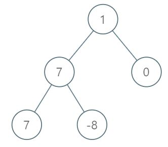

给你一个二叉树的根节点 `root`。设根节点位于二叉树的第 `1` 层，而根节点的子节点位于第 `2` 层，依此类推。

请返回层内元素之和 **最大** 的那几层（可能只有一层）的层号，并返回其中 **最小** 的那个。

**示例 1：**

<pre><strong>输入：</strong>root = [1,7,0,7,-8,null,null]
<strong>输出：</strong>2
<strong>解释：</strong>
第 1 层各元素之和为 1，
第 2 层各元素之和为 7 + 0 = 7，
第 3 层各元素之和为 7 + -8 = -1，
所以我们返回第 2 层的层号，它的层内元素之和最大。
</pre>

**示例 2：**

<pre><strong>输入：</strong>root = [989,null,10250,98693,-89388,null,null,null,-32127]
<strong>输出：</strong>2
</pre>

**提示：**

* 树中的节点数在 `[1, 104]`范围内
* `-105 <= Node.val <= 105`
