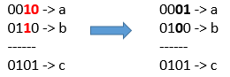

给你三个正整数 `a`、`b` 和 `c`。

你可以对 `a` 和 `b` 的二进制表示进行位翻转操作，返回能够使按位或运算   `a` OR `b` == `c`  成立的最小翻转次数。

「位翻转操作」是指将一个数的二进制表示任何单个位上的 1 变成 0 或者 0 变成 1 。

**示例 1：**

<pre><strong>输入：</strong>a = 2, b = 6, c = 5
<strong>输出：</strong>3
<strong>解释：</strong>翻转后 a = 1 , b = 4 , c = 5 使得 a OR b == c</pre>

**示例 2：**

<pre><strong>输入：</strong>a = 4, b = 2, c = 7
<strong>输出：</strong>1
</pre>

**示例 3：**

<pre><strong>输入：</strong>a = 1, b = 2, c = 3
<strong>输出：</strong>0
</pre>

**提示：**

* `1 <= a <= 10^9`
* `1 <= b <= 10^9`
* `1 <= c <= 10^9`
