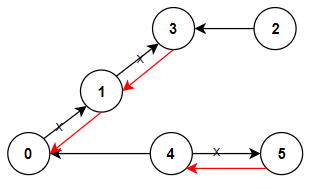

`n` 座城市，从 `0` 到 `n-1` 编号，其间共有 `n-1` 条路线。因此，要想在两座不同城市之间旅行只有唯一一条路线可供选择（路线网形成一颗树）。去年，交通运输部决定重新规划路线，以改变交通拥堵的状况。

路线用 `connections` 表示，其中 `connections[i] = [a, b]` 表示从城市 `a` 到 `b` 的一条有向路线。

今年，城市 0 将会举办一场大型比赛，很多游客都想前往城市 0 。

请你帮助重新规划路线方向，使每个城市都可以访问城市 0 。返回需要变更方向的最小路线数。

题目数据 **保证** 每个城市在重新规划路线方向后都能到达城市 0 。

**示例 1：**

<pre><strong>输入：</strong>n = 6, connections = [[0,1],[1,3],[2,3],[4,0],[4,5]]
<strong>输出：</strong>3
<strong>解释：</strong>更改以红色显示的路线的方向，使每个城市都可以到达城市 0 。</pre>

**示例 2：**

<pre><strong>输入：</strong>n = 5, connections = [[1,0],[1,2],[3,2],[3,4]]
<strong>输出：</strong>2
<strong>解释：</strong>更改以红色显示的路线的方向，使每个城市都可以到达城市 0 。</pre>

**示例 3：**

<pre><strong>输入：</strong>n = 3, connections = [[1,0],[2,0]]
<strong>输出：</strong>0
</pre>

**提示：**

* `2 <= n <= 5 * 10^4`
* `connections.length == n-1`
* `connections[i].length == 2`
* `0 <= connections[i][0], connections[i][1] <= n-1`
* `connections[i][0] != connections[i][1]`
