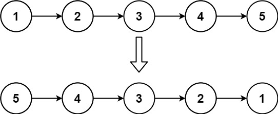
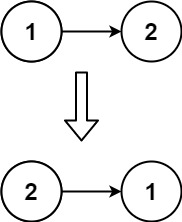

给你单链表的头节点 `head` ，请你反转链表，并返回反转后的链表。

**示例 1：**

<pre><strong>输入：</strong>head = [1,2,3,4,5]
<strong>输出：</strong>[5,4,3,2,1]
</pre>

**示例 2：**

<pre><strong>输入：</strong>head = [1,2]
<strong>输出：</strong>[2,1]
</pre>

**示例 3：**

<pre><strong>输入：</strong>head = []
<strong>输出：</strong>[]</pre>

**提示：**

* 链表中节点的数目范围是 `[0, 5000]`
* `-5000 <= Node.val <= 5000`

 **进阶：** 链表可以选用迭代或递归方式完成反转。你能否用两种方法解决这道题？
