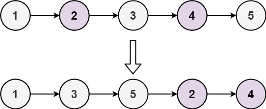
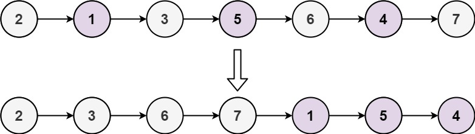

给定单链表的头节点 `head` ，将所有索引为奇数的节点和索引为偶数的节点分别组合在一起，然后返回重新排序的列表。

**第一个**节点的索引被认为是 **奇数** ， **第二个**节点的索引为 **偶数** ，以此类推。

请注意，偶数组和奇数组内部的相对顺序应该与输入时保持一致。

你必须在 `O(1)` 的额外空间复杂度和 `O(n)` 的时间复杂度下解决这个问题。

**示例 1:**

<pre><strong>输入: </strong>head = [1,2,3,4,5]
<strong>输出:</strong> [1,3,5,2,4]</pre>

**示例 2:**

<pre><strong>输入:</strong> head = [2,1,3,5,6,4,7]
<strong>输出:</strong> [2,3,6,7,1,5,4]</pre>

**提示:**

* `n == ` 链表中的节点数
* `0 <= n <= 104`
* `-106 <= Node.val <= 106`
