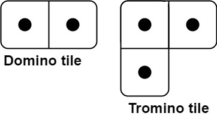
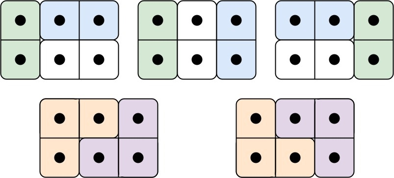

有两种形状的瓷砖：一种是 `2 x 1` 的多米诺形，另一种是形如 "L" 的托米诺形。两种形状都可以旋转。

给定整数 n ，返回可以平铺 `2 x n` 的面板的方法的数量。**返回对** `109 + 7` **取模 **的值。

平铺指的是每个正方形都必须有瓷砖覆盖。两个平铺不同，当且仅当面板上有四个方向上的相邻单元中的两个，使得恰好有一个平铺有一个瓷砖占据两个正方形。

**示例 1:**

<pre><strong>输入:</strong> n = 3
<strong>输出:</strong> 5
<strong>解释:</strong> 五种不同的方法如上所示。
</pre>

**示例 2:**

<pre><strong>输入:</strong> n = 1
<strong>输出:</strong> 1
</pre>

**提示：**

* `1 <= n <= 10`
