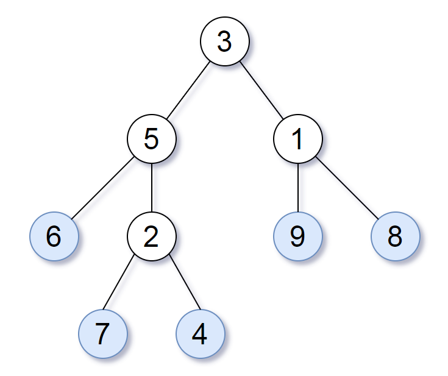
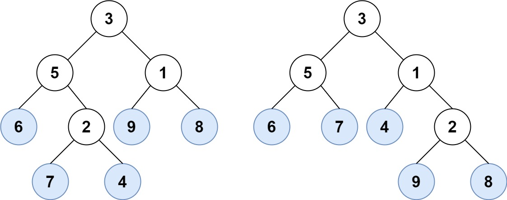
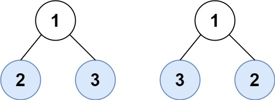

请考虑一棵二叉树上所有的叶子，这些叶子的值按从左到右的顺序排列形成一个  **叶值序列** 。

举个例子，如上图所示，给定一棵叶值序列为 `(6, 7, 4, 9, 8)` 的树。

如果有两棵二叉树的叶值序列是相同，那么我们就认为它们是 *叶相似* 的。

如果给定的两个根结点分别为 `root1` 和 `root2` 的树是叶相似的，则返回 `true`；否则返回 `false` 。

**示例 1：**

<pre><strong>输入：</strong>root1 = [3,5,1,6,2,9,8,null,null,7,4], root2 = [3,5,1,6,7,4,2,null,null,null,null,null,null,9,8]
<strong>输出：</strong>true
</pre>

**示例 2：**

<pre><strong>输入：</strong>root1 = [1,2,3], root2 = [1,3,2]
<strong>输出：</strong>false
</pre>

**提示：**

* 给定的两棵树结点数在 `[1, 200]` 范围内
* 给定的两棵树上的值在 `[0, 200]` 范围内
